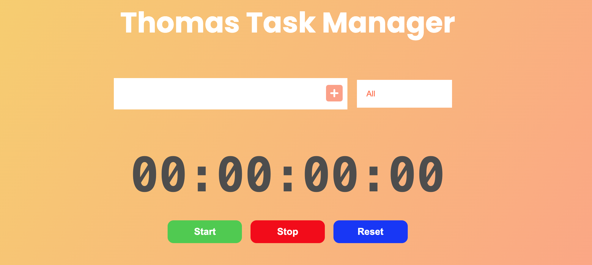
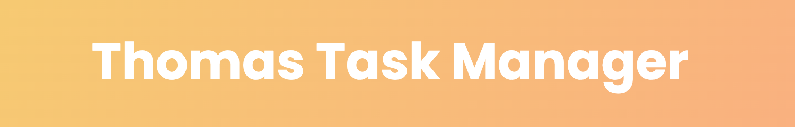
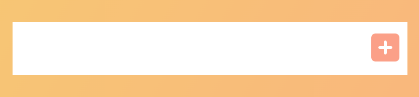
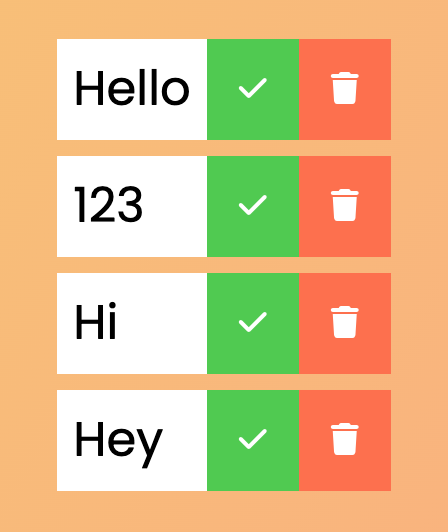
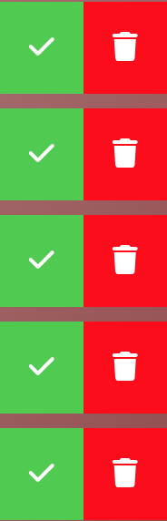
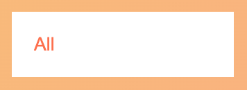
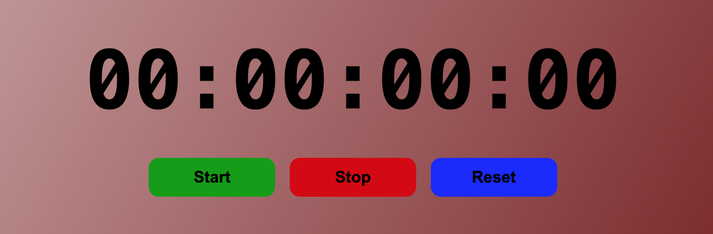
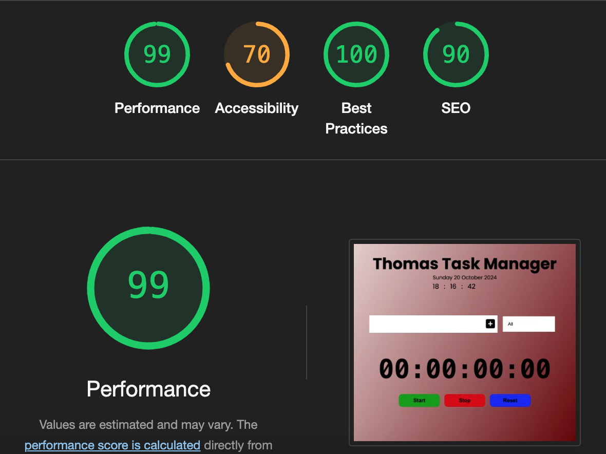

# Thomas Task Manager

This project is a good visiual learning experience where it can give a person an added piece of creativity in terms of a nice color design and functions for future projects.

## Features

* The user writes one or more tasks that he or she needs to do. The user can later on mark each task as completed or remove the task if the user has changed their mind. The user can also use the select options to see which tasks that has been completed or uncompleted. All the actions the users take on the site will get stored in the in a local storage so when they return to the page everything will be saved. The project also has a timer with a start, stop and reset function so the user can track their time.

## Background design

* The color style: linear-gradient(120deg, #f6d365, #fda085) was used as a background image for this project. This gives the user a fun and beutiful color to watch instead of just one simple and same color.

## Title

* The title was created with google fonts where "Popppins" was used and sans-serif.

## Text input field

* The text input field have a clean white background where the user can type their text of tasks. The text has been nicely centered so the text isn't stuck to the edge.

## Text input field button

* Next to the text input field the user can find a button. The button has a hover effect so it changes color when that event happens.

## The tasks

* The tasks pops up when the user presses the text input field button. To the right side of the tasks items the user can find a green checkmark button and a trashcan button.

## Checkmark and trashcan buttons

* The checkmark button can be used by the user when a task is completed and will have a line-through effect with some opacity to make it look creative.

* The trachcan button can be used by the user when they want to remove a task.

## Select options button

* Here the user can choose and filter the tasks that has been completed or uncompleted. They can also pick the option of choosing all.

## Timer

* Here the user can keep track of their time so they know how much time they have invested for a task.

* The timer consists of hours, minutes, seconds and milliseconds in the display.

* The timer has a green start button, a red stop button and a blue reset button.

## Features left to improve the project

* Adding dates.

* Adding a realtime clock function for each country world wide.

## Validator testing

The HTML and CSS code has been validated through:

* W3C Validator(HTML): https://validator.w3.org/nu/

* Jigsaw Validator(CSS): https://www.w3.org/

* JSHint(Javascript): https://jshint.com/

## Overall tests

* Lighthouse results:

## Unfixed bugs

* There is a problem for Mac users to click on the filter buttons. When the mac user clicks on the buttons they need to click 2 times and when a windows pc computer clicks on the button they only need to press it once. Multiple different individuals and support teams with programming experience have reviewed the bug and haven't been able to solve it yet.

## Deployment

* The deployment was made through github. The step by step process where the following: Settings --> Pages --> Source --> Deploy from a branch --> Main --> /(root) --> Save.

## Credit

* This project was inspired by my childhood friends Dennis and Marcel where they thaught me a great deal about programming. Both of them are full-stack developers.

## Media

* All the icons used in the code was taken from font awsome. Here is a url adress to their homepage: https://fontawesome.com/

* https://fonts.google.com/