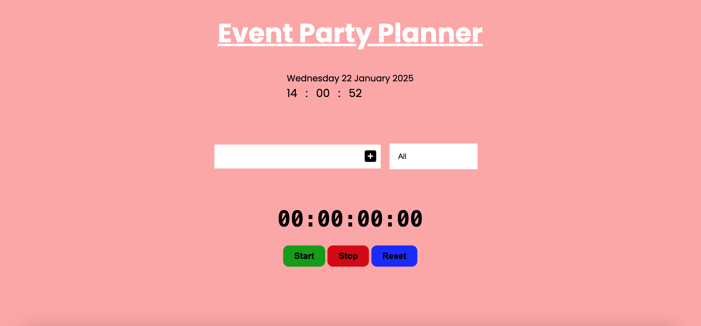
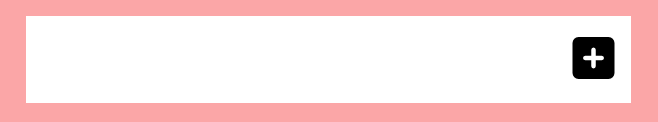
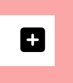
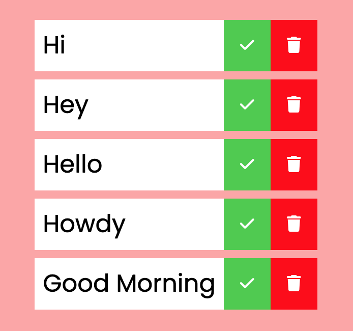
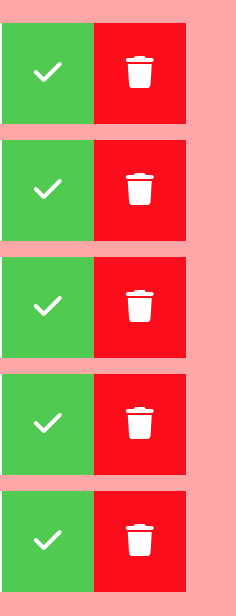
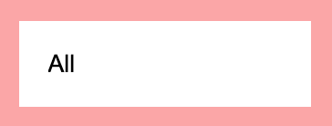
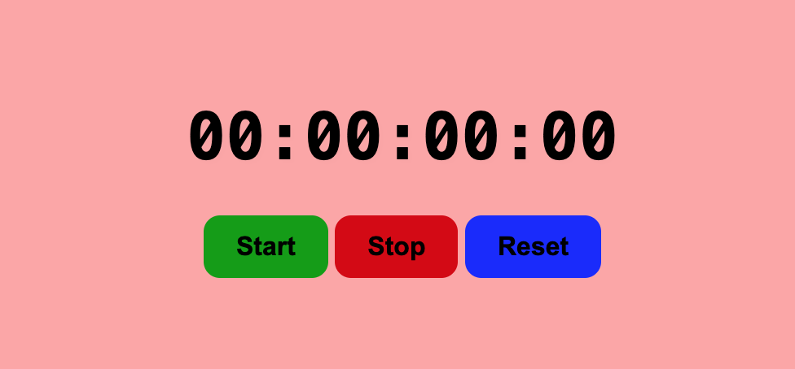
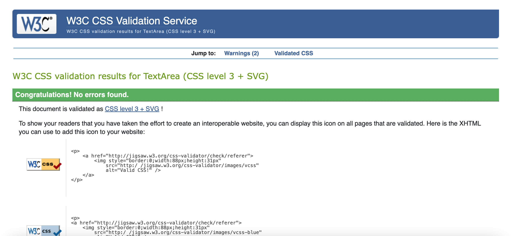
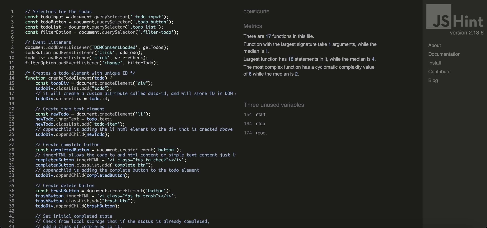
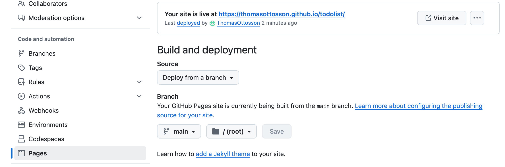

# Event Party Planner

This project is a good visiual learning experience where it can give a person an added piece of creativity in terms of a nice color design and functions for future projects. 

## Features

* The user writes one or more tasks that he or she needs to do to plan a party. The user can later on mark each task as completed or remove the task if the user has changed their mind. 

* The user can also use the select filter options to see which tasks that has been completed or uncompleted. 

* All the tasks the users create on the site will get stored in the in a local storage so when they return to the page everything will be saved. 

* The task manager has a timer with a start, stop and reset function so the user can track their time. 

* The task manager also has an in real life clock and date tracker.

## Background design

* The hex color style: #fda5a5 was used as a background image for this project. This gives the user a welcoming and beautiful color to watch.

## Title

* The title was created with google fonts where "Popppins" was used and sans-serif as fallback. The title also has an underline effect made through css.

## The clock

* The clock is a digital clock design which tracks the current date and time.

## Text input field

* The text input field have a clean white background where the user can type their text of tasks. The text has been nicely centered so the text isn't stuck to the edge.

## Text input field button

* Next to the text input field the user can find a button. That button has a hover effect so it changes color when that event happens.

## The tasks

* The tasks pops up when the user presses the text input field button. To the right side of the tasks items the user can find a green checkmark button and a trashcan button.

## Checkmark and trashcan buttons

* The checkmark button can be used by the user when a task is completed and will have a line-through effect with some opacity to make it look creative.

* The trachcan button can be used by the user when they want to remove a task.

## Select filter options button

* Here the user can choose and filter the tasks that has been completed or uncompleted. They can also pick the option of choosing all.

## Timer

* Here the user can keep track of their time so they know how much time they have invested for a task.

* The timer consists of hours, minutes, seconds and milliseconds in the display.

* The timer has a green start button, a red stop button and a blue reset button.

* All the timer buttons have a hover effect so the colors become brighter and they have a transition effect of background-color 0.5s ease in CSS.

## Features left to improve the project

* Adding deadline dates for each task.

* Adding a function which can track how much time spent on each task.

* Adding an edit button for each task incase an user wants to rename a task for future purposes or misspellings.

* Adding a tool which can move around the tasks based on priority.

* Adding a local storage for the timer.

## Validator testing

The HTML, CSS and javascript code has been validated through:

* W3C Validator(HTML): https://validator.w3.org/nu/

* Jigsaw Validator(CSS): https://jigsaw.w3.org/css-validator/

* JSHint(Javascript): https://jshint.com/

JS Hint shows three unused variables since js hint can't detect the variables used in the html file. 

## Overall tests

* Lighthouse results:

## Unfixed bugs

* There is a problem for Mac users to click on the filter buttons. When the mac user clicks on the buttons they need to click 2 times and when a windows pc computer clicks on the button they only need to press it once. Multiple different individuals and support teams with programming experience have reviewed the bug and haven't been able to solve it yet.

## Deployment

* The deployment was made through github. The step by step process where the following: Settings --> Pages --> Source --> Deploy from a branch --> Main --> /(root) --> Save.

## Credit

* The Html and css basics of this code was inspired by Code Institute's love running project. Here is a link to Code Institute's website: https://codeinstitute.net/

* Here is the Code Institute's CI template i used: https://github.com/Code-Institute-Org/ci-full-template

* Some of my Javascript knowledge regarding this project came from this video: https://www.youtube.com/watch?v=W6NZfCO5SIk. Youtube channel: https://www.youtube.com/@programmingwithmosh

* Some of my CSS knowledge regarding this project came from this video: https://www.youtube.com/watch?v=phWxA89Dy94: Youtube channel: https://www.youtube.com/@slayingthedragon

* Some of my CSS design knowledge regarding this project came from this video: https://www.youtube.com/watch?v=4kWHW7da4U8. Youtube channel: https://www.youtube.com/@KevinPowell

* Some of my Javascript knowledge came from this video: https://www.youtube.com/watch?v=Ttf3CEsEwMQ&t=2017s. Youtube Channel: https://www.youtube.com/@developedbyed

* Some of my Javascript knowledge came from this video: https://www.youtube.com/watch?v=CIOzgvzcvwg. Youtube channel: https://www.youtube.com/@learning-axis

* Some of my Javascript knowledge came from this video: https://www.youtube.com/watch?v=d8-LGhKtzRw&t=815s. Youtube channel: https://www.youtube.com/watch?v=d8-LGhKtzRw&t=815s

* Some of my Javascript knowledge and code was inspired by my freinds Dennis and Marcel who are both full-stack Developers. Some of the knowledge was inspired through lessons at Code Institute, most of the learning material is not accessed to the public at Code Institute unless you sign up for the Course.

## Media

* All the icons used in the code was taken from font awsome. Here is a url adress to their homepage: https://fontawesome.com/

* Some font were taken from google fonts and here is a url adress to their homepage: https://fonts.google.com/